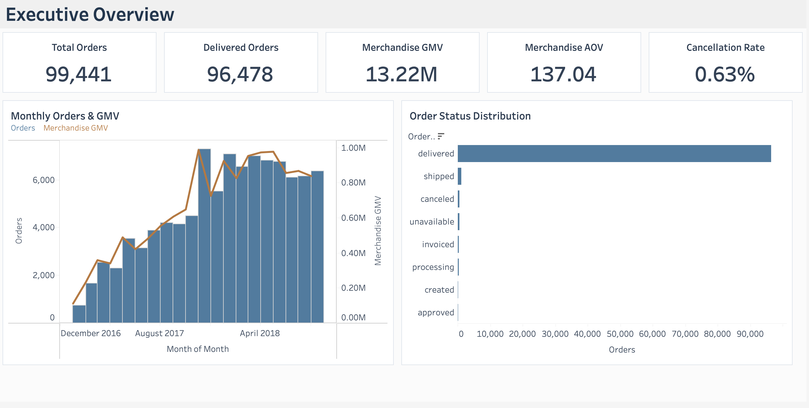
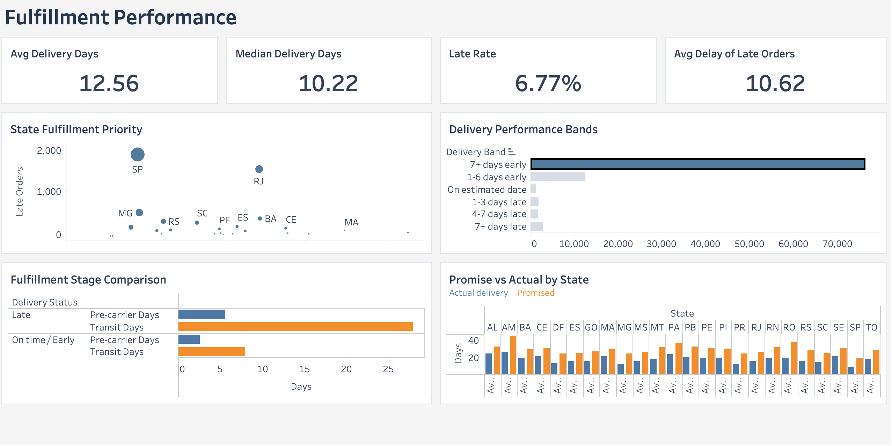
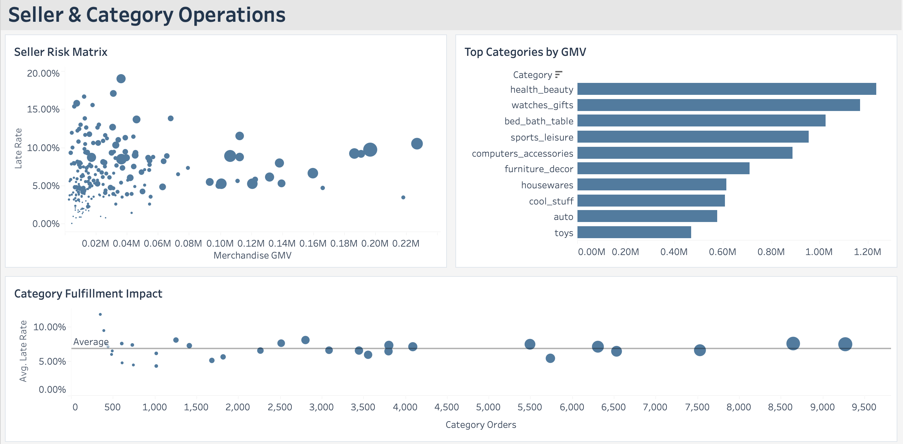
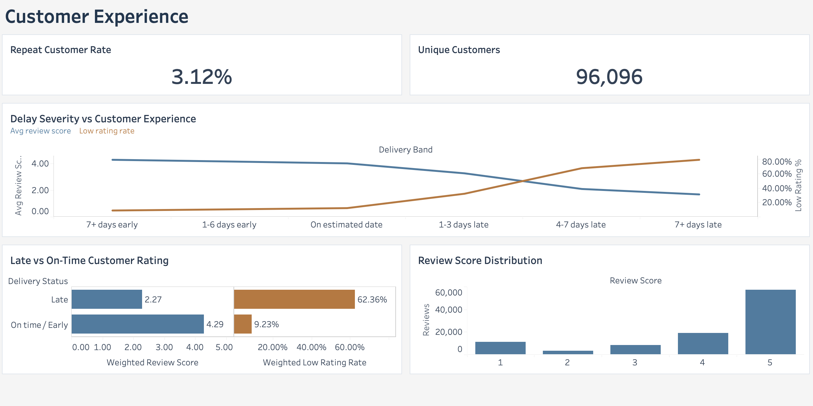

# GlobalCart — 端到端业务数据分析

[English](README.md) | [中文](README_CN.md)

**Python · Pandas · PostgreSQL · SQL · Tableau**

GlobalCart 是一个基于 **Olist 巴西电商公开数据集** 的端到端业务数据分析项目。项目使用约 **10 万笔电商订单**，完整覆盖从原始多表数据处理、数据库建模、SQL 业务分析到 Tableau 可视化呈现的全过程。

## 数据背景、业务问题与目标

项目围绕四类实际业务问题展开：

1. 平台整体业务表现和月度趋势如何？
2. 履约延迟主要集中在哪里，哪些地区应该优先处理？
3. 哪些卖家和品类同时具有较高业务价值与履约风险？
4. 配送表现与用户评价之间存在怎样的关系？

整体分析流程：

`Raw CSV → Python 数据探查与清洗 → PostgreSQL → SQL 业务分析与分析视图 → Tableau Dashboard`

## 重点设计

- **先 Profiling，再 Cleaning：** 对配送时间缺失值先结合订单生命周期状态判断，不直接批量删除。
- **JOIN 前先确认 Grain：** 按订单、订单商品、卖家和品类等不同粒度设计指标，避免多表 JOIN 后重复计数。
- **Unknown ≠ False：** 对 `is_late` 使用可空布尔逻辑，没有配送证据的订单不会被误判为“准时”。
- **SQL 负责业务逻辑，Tableau 负责呈现：** 在 PostgreSQL 中建立可复用分析视图，统一 KPI 口径，再由 Tableau 完成交互式展示。
- **运营优先级不只看单一比例：** 将地区履约优先级从单一 Late Rate 扩展为 **Rate × Volume × Promise Setting**。

## Tableau Dashboard

### 1. Executive Overview｜业务总览
展示订单规模、订单状态、月度订单量与 Merchandise GMV。

### 2. Fulfillment Performance｜履约表现
展示平均配送时长、延迟率、地区履约优先级、履约阶段拆分以及承诺配送时间与实际配送时间。

### 3. Seller & Category Operations｜卖家与品类运营
展示 Seller Risk Matrix、Top Categories by GMV，以及品类履约风险与影响。

### 4. Customer Experience｜用户体验
展示评价分布、复购客户率，以及不同延迟程度与用户评分之间的关系。

## 代表性发现

- **Late Rate 不能单独代表运营优先级：** AL 延迟率最高，但 SP、RJ 因订单规模更大，实际影响的延迟订单数量更高。
- **延迟订单的主要时间差出现在 Transit 阶段：** Late Orders 在 Pre-carrier 和 Transit 两个阶段都更慢，但 Transit 差距明显更大。
- **配送延迟与低评分高度相关：** 延迟订单平均评分为 **2.27**，准时/提前订单为 **4.29**；延迟 7 天以上订单的低评分率达到 **79.18%**。

## 环境与技术栈

| 层级 | 工具 |
|---|---|
| 开发环境 | macOS、VS Code、Python 3.12、`.venv` 虚拟环境 |
| 数据处理 | Pandas、NumPy、Jupyter |
| 数据库 / ETL | PostgreSQL 18、SQLAlchemy、psycopg、python-dotenv |
| SQL 开发 | DBeaver、PostgreSQL |
| 可视化 | Tableau Desktop |
| 版本控制 | Git、GitHub |

## 仓库内容

- `notebooks/` — Data Profiling
- `src/` — 数据清洗与 PostgreSQL 入库脚本
- `sql/` — 业务分析 SQL 与 BI Views
- `dashboard/` — Tableau 截图 / Workbook
- `README.md` — English version

> 数据来源：Brazilian E-Commerce Public Dataset by Olist（Kaggle）
